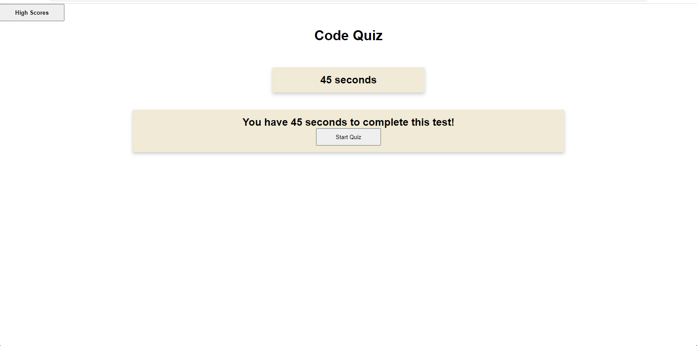

# code-quiz

[Visit the Deployed Site](https://azurek17.github.io/code-quiz/)

### Technoloy used:
* JavaScript - If...Else - https://www.w3schools.com/jsref/jsref_if.asp
* JavaScript - Logical Operators - https://www.w3schools.com/java/java_operators.asp
* JavaScript - For Loop - https://www.w3schools.com/java/java_for_loop.asp
* JavaScript - timerIntervals - https://www.w3schools.com/js/js_timing.asp
* Web API's - Event Listeners - https://www.w3schools.com/jsref/met_document_addeventlistener.asp

## Description

A timed Quiz.

## Usage

When you go to the website, you are prompt to "Start Quiz".  Then the user clicks the "Start Quiz" the following occurs:

A timer start and starts to count down.  The first question shows, with four answers to choose from.  If you select an incorrect number. Time is deducted from the clock.
if the answer is correct, then the second questions prompts.  i

The Quiz is over when you answer all the questions correctly, or you run out of time.

You will then enter you initials for the highScore display.

Below are a few examples of code:

### Event Listner:

answerList.addEventListener("click", function (event) {
    if (questions.answer === questions.correct_answer) {  
        seconds = seconds - 8;
        } else { 
        quizContainer.style.display = "none";
        quizContainer1.style.display = "block";
        display1(0);
        } 
    })

### Timer Countdown

function setTimer() {
    var timerInterval = setInterval(function() {
        seconds--;
        timer.textContent = seconds + " seconds left.";

    }, 1000);      
}

## Credits
* Tutoring Session: Abdullah Al Hilfi (via Calendly)

----------------------------------------------------------------------------------
© 2023 github.com/AZurek17/quiz-code Confidential and Proprietary. All Rights Reserved.
